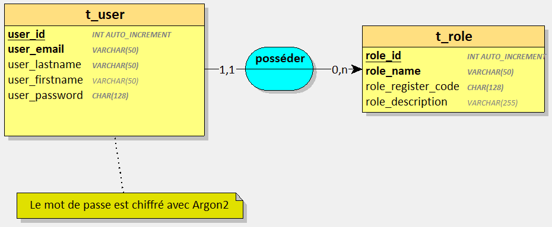
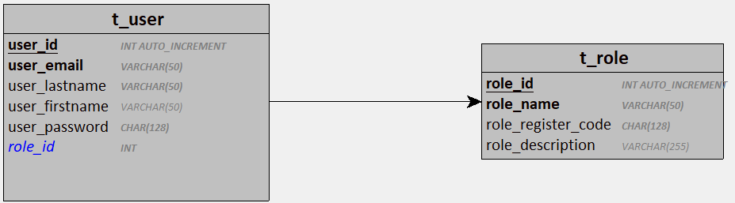

# Base de données Gestion d'utilisateurs 

**Base de données :** 
- Serveur : `MariaDB 11`
- Port : `3310`
- Nom de la base de données : `db_users` 
- Nom de l'image Docker : `gestion-utilisateur-database`
- Nom du conteneur Docker : `gestion-utilisateur-database` 
- Nom du volume Docker :  `gestion-utilisateur-data`

**Créer l'image Docker**

`docker build . -t mdevoldere/gestion-utilisateur-database:1.0`

**Créer le container**

`docker run -d -p 3310:3306 -v gestion-utilisateur-data:/var/lib/mysql --name gestion-utilisateur-database mdevoldere/gestion-utilisateur-database:1.0`

## Contexte 

- Un utilisateur est caractérisé par un nom, un prénom, une adresse email, un mot de passe chiffré et une description
- Un utilisateur enregistré possède 1 rôle parmi la liste suivante :
    - Usager
    - Encadrant
    - Administrateur
- Un rôle est caractérisé par un nom, une description et un code d’inscription chiffré.

## Dictionnaire des données 

| Mnémonique | Signification | Type | Type SQL | Longueur | Remarques |
| --- | --- | --- | --- | ---| ---|
| user_id | Identifiant de l'utilisateur | Numérique | INT | 11 | Identifiant, A.I |
| user_email | Email de l'utilisateur | Alphanumérique | VARCHAR | 50 | Obligatoire, unique |
| user_lastname | Nom de l'utilisateur | Alphabétique | VARCHAR | 50 | Obligatoire |
| user_firstname | Prénom de l'utilisateur | Alphabétique | VARCHAR | 50 | Facultatif |
| user_password | Mot de passe chiffré de l'utilisateur | Alphanumérique | CHAR | 128 | Obligatoire, chiffré avec Argon2 |
| role_id | Identifiant du rôle | Numérique | INT | 11 | Identifiant, A.I  |
| role_name | Nom du rôle | Alphabétique | VARCHAR | 50 | Obligatoire, unique |
| role_description | Description du rôle | Alphanumérique | VARCHAR | 255 | Facultatif |
| role_register_code | code d'inscription du rôle | Alphanumérique | CHAR | 128 | Obligatoire, chiffré avec Argon2 |

## Dépendances fonctionnelles simples 

user_id --> user_email, user_lastname, user_firstname, user_password, role_id

role_id --> role_name, role_description, role_register_code

## Règles de gestion

1 utilisateur possède **1** seul rôle

1 rôle est possédé par **0 ou plusieurs** utilisateurs

## Modèle Conceptuel des Données (MCD)

## Modèles Logique des Données (MLD) 

## Jeu d'essai 

| role_id | role_name | role_register_code | role_description | 
| --- | --- | --- | --- | 
| 1 | Usager | AZER | Un utilisateur standard |
| 2 | Encadrant | 1234 |  |
| 3 | Administrateur | AZERTY | A accès à tout |

| user_id | user_email | user_lastname | user_firstname | user_password | role_id |
| --- | --- | --- | --- | --- | --- | 
| 1 | toto@example.com | ingals | charles | azerty | 3 | 
| 2 | bertrand@example.com | macron |  | 123456 | 1 | 
| 3 | germaine@example.fr | lustucru | germaine | 1234 | 2 | 
| 4 | daniel@example.com | germain | daniel | azer | 1 | 
| 5 | celine@example.com | dion | céline | rené | 2 | 